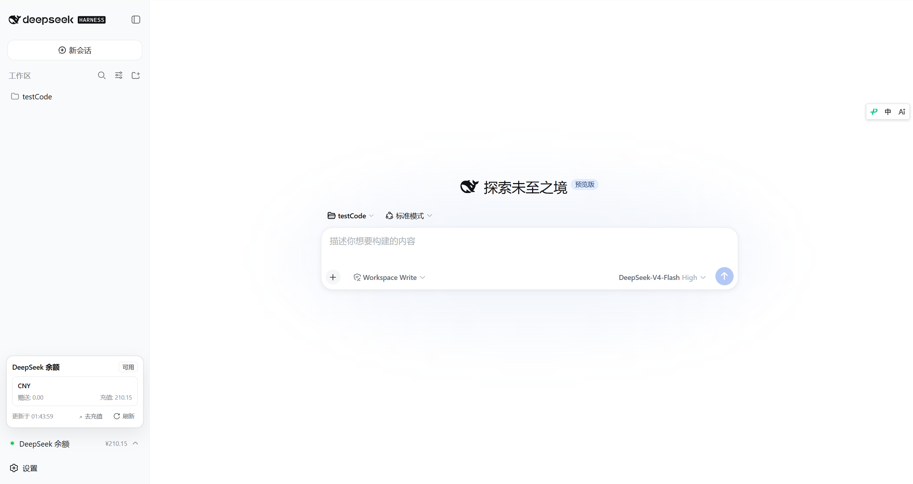

# dsh-deepseek-balance

DeepSeek Harness 插件：在 Web GUI 的**侧边栏底部**实时显示 DeepSeek 账户余额。

- 官方接口：`GET https://api.deepseek.com/user/balance`
- API Key 通过 DSH 自身的凭据服务读取（`设置 → 模型` 里配置的 `DEEPSEEK_API_KEY`，或启动环境变量），**密钥只留在主机侧，浏览器拿不到**
- 侧边栏常驻显示总额（¥0.29 这样的紧凑形式），点击弹出详情：总额 / 赠送 / 充值、可用状态、更新时间，支持手动刷新
- 默认每 60 秒自动刷新（页面隐藏时暂停，回到前台立即刷新）
- 余额低于阈值（默认 ¥20）时状态点变琥珀色警示，账户不可用时变红

## 效果预览



## 安装

从 GitHub 安装（推荐）：

```powershell
dsh plugin --profile web add github:ewbang/dsh-deepseek-balance
```

等价写法（完整 git URL，可指定分支 / 标签 / 提交）：

```powershell
dsh plugin --profile web add git+https://github.com/ewbang/dsh-deepseek-balance.git
dsh plugin --profile web add github:ewbang/dsh-deepseek-balance#main
```

> 前提：本机已安装 [pnpm](https://pnpm.io/installation) 且 `git` 在 PATH 中（`dsh plugin` 内部通过 pnpm 安装 git 依赖）。

安装后**重启 dsh web 服务**（`Ctrl+C` 停掉，再 `dsh web` 启动），刷新浏览器页面即可在侧边栏底部看到余额。

## 配置

插件的所有选项都在 `cordis.patch.yml` 的 `dsh-balance` 行里，默认值如下：

| 键 | 默认值 | 说明 |
| --- | --- | --- |
| `apiKeyEnv` | `DEEPSEEK_API_KEY` | 凭据引用名（对应 `.credentials.yaml` / 环境变量） |
| `baseURL` | `https://api.deepseek.com` | DeepSeek OpenAPI 地址 |
| `routePath` | `/api/dsh-balance` | 主机侧同源代理路由 |
| `cacheMs` | `30000` | 主机侧缓存时长（避免多标签页频繁打 API） |
| `refreshMs` | `60000` | 前端轮询间隔 |
| `lowThreshold` | `20` | 余额低于该值显示警示（按主币种） |
| `requestTimeoutMs` | `15000` | 上游请求超时 |

想覆盖配置：编辑 `%USERPROFILE%\.dsh\profiles\web\cordis.patch.yml`，按行 id `dsh-balance`
重写整个 `config` 块即可（patch 会整块替换），例如：

```yaml
- id: dsh-balance
  config:
    apiKeyEnv: DEEPSEEK_API_KEY
    baseURL: https://api.deepseek.com
    routePath: /api/dsh-balance
    cacheMs: 15000
    refreshMs: 30000
    lowThreshold: 50
    requestTimeoutMs: 15000
```

## 工作原理

- **主机侧**（`lib/index.js`）：loader 把它当作普通插件行挂载，向 `webServer` 注册一条 exact 路由
  `/api/dsh-balance`。每次请求用 `ctx.credentials.resolve("DEEPSEEK_API_KEY")` 取密钥，
  代理调用 `/user/balance`，返回一个扁平化 JSON 信封；路由带 Host 校验（防 DNS rebinding）。
- **浏览器侧**（`lib/client.js`）：`dsh-client-modules` 扫描到该包声明了
  `dsh.client.platform: "web"` 与 `exports["./client"]`，把它编入 `window.__DSH_BOOT__`
  模块图并托管 `/plugins/dsh-deepseek-balance/client.js`。侧边栏小组件通过
  `sidebar.footer.action` 插槽注册，定时拉取上面的同源路由。
- 无任何运行时依赖（主机侧零 import，浏览器侧只依赖平台种子模块）。

## 卸载

```powershell
dsh plugin --profile web remove dsh-deepseek-balance
```

或直接编辑 `%USERPROFILE%\.dsh\profiles\web\package.json`，从
`dsh.profile.bundles` 移除 `dsh-deepseek-balance` 并删除依赖，然后重启。

## 常见问题

- **看不到余额**：确认 `设置 → 模型` 里已配置 DeepSeek API Key（或环境变量
  `DEEPSEEK_API_KEY`），并重启过服务。
- **显示“未配置 API Key”**：端点返回 `no-api-key`，说明凭据解析不到，按提示配置后无需重启
  插件（凭据服务每次请求实时解析）。
- **余额一直是“—”**：右上角弹窗里能看到具体错误；多半是上游网络问题（`network`/`timeout`）。

## 开发

```powershell
node scripts/smoke-host.js     # 主机侧冒烟测试：模拟 ctx，打真实 /user/balance 接口
node scripts/smoke-client.js   # 浏览器侧冒烟测试：加载 client bundle 并用真实 React 渲染组件
# 以下脚本需要本机 Chrome，且 dsh web 正在运行：
node scripts/cdp-probe.mjs     # 通过 CDP 测量侧边栏底部徽章的几何尺寸，核对与设置按钮对齐
node scripts/cdp-open.mjs      # 模拟点击余额徽章，验证弹层定位与内容
```

